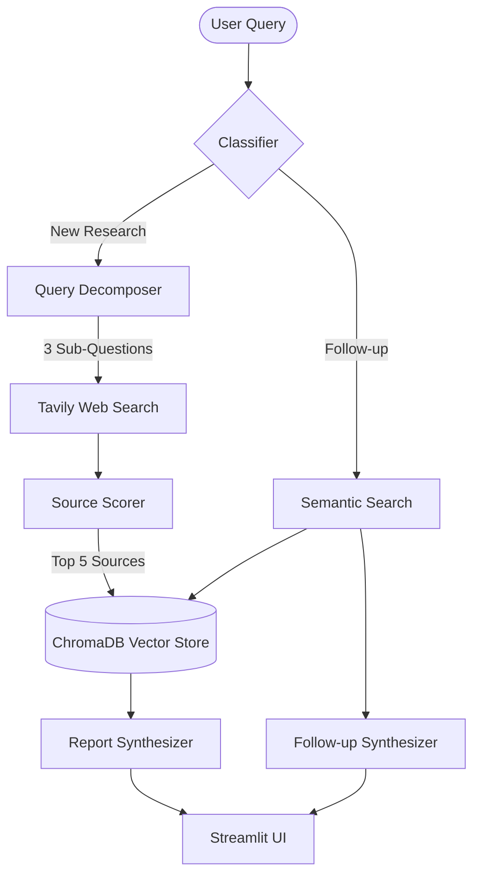

<div align="center">
  <h1>🔬 ResearchMind</h1>
  <p><strong>Agentic, Chat-Based AI Research Assistant</strong></p>

  [](https://researchmind-idvhtpjhjwmt4zuydlztjv.streamlit.app/)
  [](https://www.python.org/downloads/)
  [](https://groq.com/)
  [](https://python.langchain.com/)
  
  <br>
  
  **Live Demo → [researchmind.streamlit.app](https://researchmind-idvhtpjhjwmt4zuydlztjv.streamlit.app/)**
</div>

---

## ⚡ What it does

ResearchMind is an advanced AI research assistant that doesn't just answer questions—it **researches them**. It searches the live web from multiple angles, rigorously scores source credibility, builds a per-session vector knowledge base, and generates structured, citation-backed research reports inside a stunning, responsive Glassmorphism UI.

You type a research question, and ResearchMind automatically:
1. **Classifies** your intent (New Research vs Follow-up).
2. **Decomposes** complex queries into 3 targeted research angles using **Llama 3.3 70B**.
3. **Searches** the live web via **Tavily API**, aggregating up to 12 diverse sources.
4. **Scores** every source on Recency, Relevance, and Domain Credibility.
5. **Embeds** the top highly-credible sources into a **ChromaDB** vector store.
6. **Synthesizes** a pristine, 6-section Markdown report with inline citations.
7. **Answers** follow-ups using RAG directly from the session's vector store.

---

## 🏗️ Agentic Architecture



---

## 📑 Report Structure

Every deep-dive research report automatically contains:
- **Executive Summary** — Crisp 2-3 sentence overview.
- **Key Findings** — Specific, bulleted insights with inline citations.
- **Deep Analysis** — Nuanced, detailed paragraphs analyzing the core topic.
- **Conflicting Viewpoints** — AI-driven analysis of where sources disagree.
- **Knowledge Gaps** — Identification of what remains unclear or understudied.
- **Sources Used** — Title, URL, and computed Credibility Score.

---

## 💻 Tech Stack

| Layer | Technology |
|---|---|
| **Core LLM** | Groq (`llama-3.3-70b-versatile` / `gemma2-9b-it` fallback) |
| **Orchestration** | LangChain 🦜🔗 |
| **Web Search** | Tavily Search API |
| **Embeddings** | HuggingFace (`all-MiniLM-L6-v2`) |
| **Vector DB** | ChromaDB (In-memory per-session collections) |
| **Frontend** | Streamlit (Fully custom CSS/HTML Glassmorphism UI) |

---

## 🚀 Run Locally

```bash
# 1. Clone the repo
git clone https://github.com/Twinklingstar374/ResearchMind
cd ResearchMind

# 2. Create virtual environment
python3 -m venv venv
source venv/bin/activate

# 3. Install dependencies
pip install -r requirements.txt

# 4. Add API keys
echo "GROQ_API_KEY=your_key_here" > .env
echo "TAVILY_API_KEY=your_key_here" >> .env

# 5. Launch the app
streamlit run app.py
```

## 🐳 Run with Docker

```bash
docker build -t researchmind .
docker run -p 8501:8501 \
  -e GROQ_API_KEY=your_key_here \
  -e TAVILY_API_KEY=your_key_here \
  researchmind
```

---

## 🔑 API Keys

| Service | Get it free at |
|---|---|
| **Groq API** | [console.groq.com](https://console.groq.com) |
| **Tavily API** | [tavily.com](https://tavily.com) |

*Only 2 keys needed. Add them to `.env`.*

---

## 🧠 Key Engineering Decisions

- **Multi-Angle Decomposition**: Single-query search misses adjacent perspectives. Breaking into 3 angles ensures coverage of current state, challenges, and future trends—giving the synthesizer richer, more balanced material.
- **Source Scoring Engine**: Not all web results are equal. Scoring on domain credibility (arxiv vs random blog), recency, and Tavily relevance ensures the LLM synthesizes from the most trustworthy sources—reducing hallucination risk.
- **Per-Session ChromaDB**: Using unique `session_{uuid}` collections prevents context pollution between users and sessions, a critical correctness fix for multi-user cloud deployments.
- **Resilient Model Fallbacks**: Includes an automated try-catch fallback chain iterating through multiple LLaMA 3.3/3.1 and Gemma models to ensure 100% uptime even if a specific Groq model gets decommissioned.

---

<div align="center">
  <i>Built by Bulbul Agarwalla — B.Tech AI, Newton School of Technology</i>
</div>
